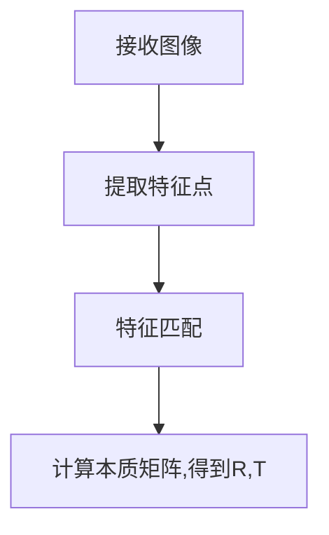

## 问题提出

在做课题时遇到了一个问题：在视觉里程计中，当平移量t较小的时候的，根据对极约束算出来的旋转矩阵R为何不可信？
<!--more-->

## 背景

上图是录制的bag中灰度相机拍摄的图像。相机位于火车头前部，由于火车移速缓慢，导致其两帧之间的平移量t相对较小，这时通过计算本质矩阵，然后分解得出的R就相当不可信了。下图为我根据其本质矩阵分解出的R,t画的轨迹图（由于火车匀速行驶，故假设火车两帧之间的运动的尺度相等）。

如果是正常的情况，因为火车在铁轨上运行，其轨迹应当为一直线，然而绘制出来的轨迹几乎是一团浆糊，其原因就是因为平移量过小，由本质矩阵分解出来的R是不可信的，不能直接用来绘制轨迹。

## 简单的视觉里程计

一个简单的单目视觉里程计的框图(参阅[冯兵的博客](http://www.fengbing.net/))：

现在假设我们已得到了上一帧与这一帧相对应的像素点，如何求得上一帧相机到这一帧的R,t呢？

## 对极约束

这里我们省去繁杂的推导，只需知道，如图a所示，对于空间点X,其在k时刻在相机平面上的投影为点x，在k+1时刻在相机平面上的投影为x',并且设k+1时刻相机相对于k时刻的坐标变换用R,t表示，则对极约束可以表示成：

$$x'^{T}Fx=0 $$
或者
$$p_2^{T}Ep_1= 0 \tag{1}$$

其中$p_2$，$p_1$为空间点P在两个像素坐标系中，以光心为原点的，投影到(z=1)归一化坐标(即深度z恒为1)。这部分的推导可以参阅高翔的《视觉SLAM十四讲》。

上式的$E$就被叫做本质矩阵(essential matrix)，并且
$$E=\hat{t}R \tag{2}$$
将E进行奇异值分解就可以得到R,t。

## 本质矩阵的尺度等价性

由式1可以看出，等式两边同时乘以$\lambda$，等式依然成立。也就是说本质矩阵的自身乘以常数后仍为该方程的一个解。而式2中，由于旋转矩阵R本身的约束，导致其行列式恒为1，则对本质矩阵的缩放实质上是作用在了t身上。也就是说，根据本质矩阵求出来的t只有方向具有意义，而其大小没有意义（因为乘以常数后对极约束仍满足）。

也正是因为这个性质，导致了当两帧之间的位移量t较小或者两帧之间是纯旋转时，用本质矩阵求解的R是不可靠的。

**纯旋转的情况：**

此时， t为0，由式2导致E=0，式1恒成立，此时无法对E进行SVD分解。

**位移量较小的情况：**

由于实际情况中，不太可能有纯旋转的情况，往往是偏移量$t=(\Delta x, \Delta y, \Delta z)$。这三个小量可以看做是均值为0的正太分布，从而导致这个偏移量t的方向是随机的（而当偏移量较大时，小量相对于真正的偏移可以忽略不计，t的方向较为固定），那么分解E得到的R也具有极大的随机性，用这个R作为旋转量绘制轨迹就会出错。

## 解决方法

单目并且不知道两帧之间的尺度的话，可以用单应矩阵来估计旋转，也可以不计算两两帧之间的本质矩阵，而是去估算每6帧之间的本质矩阵(因为t足够大)：

上图是我估计每六帧之间的R,t时绘制出来的轨迹，可以看到，一段时间内的轨迹均为直线。当然，由于我没有后端优化，所以当某一帧估计错误后，后面的轨迹会跟着继续，这也就是轨迹中折线部分的由来。

