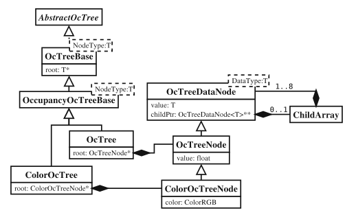
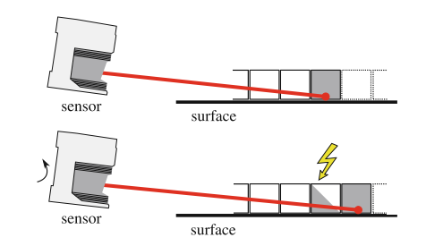

## 背景

自己虽然用过很多次八叉树地图，但是对于其概率的计算方式一直有些含糊，因此决定重新读一遍论文，来了解其原理。
<!--more-->

## 论文

Hornung, Armin, et al. "OctoMap: An efficient probabilistic 3D mapping framework based on octrees." Autonomous robots 34.3 (2013): 189-206.

## 正文

### 3 OctoMap mapping framework

#### 3.1 Octree

1. Octree 是一个有层次的数据结构。
2. Octree 中的每个Node表示空间中的一个立方体，也称为一个voxel。这个立方体会被递归地分为八个块，直到每个块达到最小的尺寸。
3. 当node的状态只有占据与free两种状态时，一个比较好的剪枝方法为，当一个node的所有children都是同一个状态，则这些children可以被裁剪掉

#### 3.2 Probabilistic sensor fusion

给定$1:t$时刻的观测值$Z_{1:t}$，则叶子节点n的占据(后验)概率$P(n|z_{1:t})$为

$$
\begin{array}{l}
P\left(n \mid z_{1: t}\right) \\
=\left[1+\frac{1-P\left(n \mid z_{t}\right)}{P\left(n \mid z_{t}\right)} \frac{1-P\left(n \mid z_{1: t-1}\right)}{P\left(n \mid z_{1: t-1}\right)} \frac{P(n)}{1-P(n)}\right]^{-1}
\end{array}
$$

这个式子涉及三个概率：
1. $P(n|z_t)$为根据当前测量得到的栅格n的占据概率
2. $P(n|z_{1:t-1})$为历史的占据概率。
3. $P(n)$为其先验概率

正常情况下，设置先验概率为0.5，然后利用log-odds表示，则上式可以表示成
$$
\mathrm{L}\left(n \mid z_{1: t}\right)=\mathrm{L}\left(n \mid z_{1: t-1}\right)+\mathrm{L}\left(n \mid z_{t}\right)
$$
其中
$$
\mathrm{L}(n)=\log \left[\frac{P(n)}{1-P(n)}\right]
$$

由于log-odds是可以转换成概率的，因此每个node不再直接存储概率，而是直接存储log-odds value。

注意到log-odds值是可以无限叠加的，所以当一个node被观测到k次占据后，至少也得要k次非占据的观测才能改变该node的占据状态。这个性质在环境物体是静态的时候是可以的，但是当环境是高度动态的时候，会导致地图的更新过于缓慢。因此，通常给log-odds函数人为设置取值上下限（称为Clamp），如下式所示。

$$
\begin{array}{l}
\mathrm{L}\left(n \mid z_{1: t}\right) \\
\quad=\max \left(\min \left(\mathrm{L}\left(n \mid z_{1: t-1}\right)+\mathrm{L}\left(n \mid z_{t}\right), l_{\max }\right), l_{\min }\right)
\end{array}
$$

#### 3.3 Multi-resolution queries

当点云的测量值给出的时候，概率值是只在八叉树的叶子节点更新的。而父节点的占据概率更新可以有两种方式
1. 平均占据概率
$$
\bar{l}(n)=\frac{1}{8} \sum_{i=1}^{8} \mathrm{L}\left(n_{i}\right)
$$
2. 最大占据概率
$$
\hat{l}(n)=\max _{i} \mathrm{L}\left(n_{i}\right)
$$

为了在机器人的导航中获得一条没有碰撞的路线，通常采用策略2。

#### 3.4 Octree map compresson 

在3.1节提到的剪枝策略是针对node状态只有0或者1而言的。当node中存储的是log-odd值时，就不能直接这么操作了。

该文提出的方法是，将log-odd值达到clamp的上界或者下界的node视为稳定的node。当一个node的四个children均为稳定，且状态相同，即可进行裁剪。并且，当有新的测量使得该node的状态发生变化的时候，该node的childern又会被重新创建。

#### 3.5 Extensions

Octree的节点可以被拓展以用来存储其他信息，例如颜色等。

本文还设计了一个软件，用来分割八叉树模型。

### 4 Implementation details

#### 4.1 Memory-efficient node implementation

为了节约八叉树的存储空间，文章采取了以下措施：

1. 首先，每个node的位置信息和size信息是在遍历的时候可以得到的，因此这些信息不会被存储在node中。
2. 其次，每个node里只保存一个指向children指针数组 的指针。当这个node为leaf时，该指针为空；否则，指向一个由八个指针组成的数组。
3. node的占据信息用一个float来存储。
4. 由于虚继承会导致虚函数表指针的创建，因此，只在octree类使用虚继承，而在octree node类中不使用虚继承。

#### 4.2 Octree types

类之间的继承关系如下所示。

在目前的实现中，树的最大深度被设置为16，从而导致当分辨率为1cm时，八叉树只能表示长宽高为655.36m的区域。但是可以修改树的最大深度为32，使得区域大大扩大。

#### 4.3 Map file generation

这里讲的是如何紧致地存储地图哈。暂时用不着。

#### 4.4 our OctoMap implementation
##### 4.4.1 Integrating sensor measurements

测量量使用$insertRay()$方法来更新ocTree。这个方法使得从机器人到测量值的终点（除终点以外）的voxel为free，而终点所在的vocel为occupied.

$insertScan()$方法则是一个优化后的批量方法，比单独trace每一条ray速度块很多。

$updateNode()$方法是根据某个点测量，单独更新octree的某个Node。

##### 4.4.2 Accessing data

- 通过坐标可以查找到某个node
- Octomap实现了迭代器，可以查找任何node,任何叶子节点以及任何bounding box内的叶子节点。
- 还提供了$castRay()$方法来供用户查询ray intersection。(即查询一束光线首次hit到的占据的volume)

### Evaluation

#### 5.1 Sensor model for laser range data

log-odds的值可以设置为：
- $l_{occ} = 0.85$
- $l_{free} = -0.4$
以对应occupied与free的概率分别为0.7与0.4

clamping threshold为$l_{min}=-2$，$l_{max}=3.5$。

当一个激光雷达在摇摆的时候，某些本该是占据的栅格会被认为是free的，如下图所示。

为了解决这个问题，整个sweep的点云会被叠加到一起，再塞入到octomap中去。

