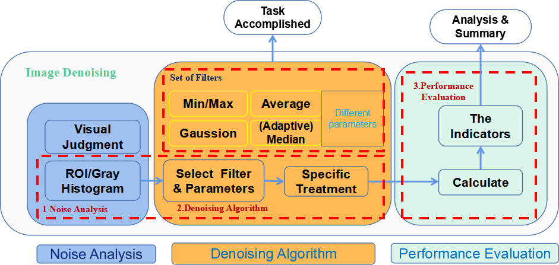

<!-- # Welcome to MrChannon's Pages -->

### ▶ Basic Infomation
----------------------------------------
- Chinese Name: **陈龙**                                                     <!-- 在右侧添加个人照片-->

- English Name: **Long Chen**

- Gender: Male

- Master degree candidate, [Networked Robotics and Systems Lab](http://nrs-lab.com/)                   

- Adress: Harbin Institute of Technology, Shenzhen, China

- Job Title: Software Developer

  <!--Community Title:-->

### ▶ Education
----------------------------------------
- [Northwestern Polytechnical University](https://www.nwpu.edu.cn/), Xi’an, China       **B.S.** 09/2015 -- 07/2019
  College of Automation
  Major: Automation (Information Engineering)
  Dissertation: Change Detection of Synthetic Aperture Radar Image Based on Deep Learning
  Supervisor: Associate Prof. Lin Li
<!--  GPA: 90.2/100 Ranking: 5/119-->

- [Harbin Institute of Technology](http://www.hitsz.edu.cn/index.html), Shenzhen, China          **M.S.** 09/2019 -- Pres.
  School of Mechanical Engineering and Automation
  Major: Pattern Recognition and Intelligent System
  Research Interest: Robotics, Artificial Intelligence, Control Systems Engineering
  Supervisor: Prof. Hao-Yao Chen, Leader of [Networked Robotics and Systems Lab](http://nrs-lab.com/)

----------

### ▶ Projects 

**Department of Control Science & Engineering, Harbin Institute of Technology, Shenzhen**
  Master Student  09/2019 -- Pres.
 

<h5>&nbsp;&nbsp;&nbsp;&nbsp;&nbsp; Real-time Object Detection and Grasp of UAM Based on Embedded NPU</h5>
&nbsp;&nbsp;&nbsp;&nbsp;&nbsp; 2019.10 - now  
&nbsp;&nbsp;&nbsp;&nbsp;&nbsp; Researcher, Author  

- The related code is open source in the [Gitee community of Huawei's Shengteng.](https://gitee.com/ascend)
- A novel real-time target detection system based on embedded NPU is researched and designed, including hardware platform building, software framework and algorithm flow. The system feeds the images collected by RGB-D camera into the system for stable model inference, which mainly relies on the target detection model based on deep learning, and finally returns the class and location information of the target. These information will be used for UAM ’s further operation. Both the theoretical analysis and the numerical experiment show that the proposed algorithm has a faster convergence rate and fewer parameters if the model pruning and retraining parameter is chosen carefully.

------

**Department of Automation, Northwestern Polytechnical University**
  Undergraduate   09/2015 -- 07/2019
 

<h5>&nbsp;&nbsp;&nbsp;&nbsp;&nbsp; Space Debris Removal Planning based on Intelligent Computing</h5>
&nbsp;&nbsp;&nbsp;&nbsp;&nbsp; 2017.10 - 2019.06  
&nbsp;&nbsp;&nbsp;&nbsp;&nbsp; Lead Researcher, Author   

- The project initially is the part of a national program undertaken by the mentor. While space debris in Low Earth Orbit poses a great threat to space activities, the Active Debris Removal is an effective method to relieve the risk of astronautic missions. We built a corresponding offline multi-objective optimal planning model, which comprehensively considers the debris priority, the transfer cost and the payloads consumption. An adapted GA based multi-objective Pareto Frontier optimization is utilized to determine the optimal solution, as it performs better and needs less computation time. Now the results have been presented at the International Conference on Evolutionary Computing.

------

<h5>&nbsp;&nbsp;&nbsp;&nbsp;&nbsp;  Air-Ground Logistics Integration with Dispatching UAV </h5>
&nbsp;&nbsp;&nbsp;&nbsp;&nbsp; 2017.05 - 2018.05  
&nbsp;&nbsp;&nbsp;&nbsp;&nbsp; Researcher, Author   

- The research is a national college student research project guided by Quan Pan-Dean ofautomation school, Northwestern Polytechnical University, which is an innovative project for domestic delivery. We aim to schedule the UAV flight path under multi-constraint based on reality, which taking the minimal traveling cost and shortest delivery time, division of cold chain and ordinary logistics, aerial vehicle capacity, delivery and pickup requirement, the damage rate of cold chain goods, time window, and the like, into consideration. Then computer experiment is carried out by applying a commercial linear equation solver Gurobi.

------

<h5>&nbsp;&nbsp;&nbsp;&nbsp;&nbsp;  Change Detection of Synthetic Aperture Radar Image</h5>
&nbsp;&nbsp;&nbsp;&nbsp;&nbsp; 2018.05 - 2019.06  
&nbsp;&nbsp;&nbsp;&nbsp;&nbsp; Researcher, Author   

- The research is.

------

### ▶ Other Projects 

----------

### ▶ Honors and Awards

- Honor of Merit Student of Harbin Institute of Technology, Shenzhen. Nov. 2020.
- First Class Scholarship of Harbin Institute of Technology, Shenzhen. Sept. 2020.
- First Class Scholarship of Harbin Institute of Technology, Shenzhen. Sept. 2019.
- Outstanding Freshman Scholarship of Harbin Institute of Technology. Aug. 2019.
- Honor of Outstanding Graduates of Northwestern Polytechnical University. July. 2019
- Excellent Graduation Design of Northwestern Polytechnical University. Jun. 2019.
- [National Scholarship for Outstanding College Students.](https://baike.baidu.com/item/%E5%9B%BD%E5%AE%B6%E5%A5%96%E5%AD%A6%E9%87%91/9693046?fr=aladdin) Oct. 2018.Highest award for undergraduates in China, top 5%)
- Honor of Merit Student of Northwestern Polytechnical University. May. 2018.
- Honorable Mention in [American Mathematical Contest in Modeling.](https://baike.baidu.com/item/%E7%BE%8E%E5%9B%BD%E5%A4%A7%E5%AD%A6%E7%94%9F%E6%95%B0%E5%AD%A6%E5%BB%BA%E6%A8%A1%E7%AB%9E%E8%B5%9B/8324806?fr=aladdin) Jan. 2018
- [National Encouragement Scholarship of China.](https://baike.baidu.com/item/%E5%9B%BD%E5%AE%B6%E5%8A%B1%E5%BF%97%E5%A5%96%E5%AD%A6%E9%87%91/4293574?fr=aladdin) Oct. 2017.
- Honor of Excellent Student Cadre of Northwestern Polytechnical University. May. 2017.
- [National Scholarship for Outstanding College Students.](https://baike.baidu.com/item/%E5%9B%BD%E5%AE%B6%E5%A5%96%E5%AD%A6%E9%87%91/9693046?fr=aladdin)  Oct. 2016. (Highest award for undergraduates in China, top 2%)

### ▶ Publication 

- Zhang, Y., & **Chen, L.** (2018, May). A Hybrid Forecasting Model Based on Modified
  Bat Algorithm and ELM: A Case Study for Wind Speed Forecasting. In IOP Conference
  Series: Earth and Environmental Science (Vol. 153, No. 2, p. 022001). IOP Publishing.
  (EI)  [pdf](https://iopscience.iop.org/article/10.1088/1755-1315/153/2/022001/meta)
- Wang, D., Li, L., & **Chen, L.** (2019, June). An Efficient Genetic Algorithm for Active
Space Debris Removal Planning. In 2019 IEEE Congress on Evolutionary Computation
(CEC) (pp. 514-521). IEEE. (EI) [pdf](https://ieeexplore.ieee.org/abstract/document/8790081?casa_token=M89UsmjTNegAAAAA:chnzjqNyUdKb6BJuCTNQbkcK82B8YwSSfU3pEqlRRZ4mYxXopMMEe7UCRAxbgcuysQW3OYS9GII)
- Zhang, Y., Zhai, S., Wang, D., & **Chen, L.** (2018, May). Path Planning-aiding System of
Unmanned Aerial Vehicle in Freight Transportation. In 2018 International Conference
on Network, Communication, Computer Engineering (NCCE 2018). Atlantis Press. [pdf](https://www.atlantis-press.com/proceedings/ncce-18/25896641)
- **Chen, L.**, Hu, J., Li, X., Quan, F., & Chen, H. (2021, July).Onboard Real-time Object Detection for UAV with Embedded NPU. In *2021 11th Institute of Electrical and Electronics Engineers  International Conference on Cyber Technology in Automation, Control, and Intelligent Systems (CYBER)* (pp. 43-48). IEEE. [pdf]()

----------

### ▶ Patent
Under way

### ▶ Other Skills

- Languages: Chinese (Mandarin, native), English (CET-6  & IELTS, 6.5). 
- Hobbies: Multimedia Design, Photography, Table Tennis, Jogging.
- Typesetting: MS Office, LaTeX.
- Programming: C/C++, Python, SQL, Shell, Java.
- Software: Matlab, Mathematica, ROS, Gazebo.
- Hardware: HUAWEI Atlas 200DK, stm32 chips, FPGA.

### ▶ Life

- To be updated